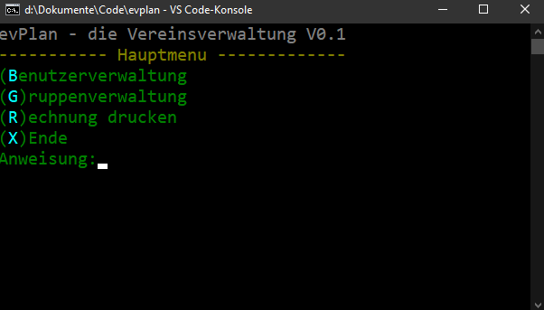

# evPlan
Eine beispielhafte Java Konsolenanwendung einer simplen Vereinsverwaltung, um mit den Schülerinnen und Schülern Blackbox, Whitebox, Unit und Integrationstests zu üben.



Im Verzeichnis **doc** befinden sich zahlreiche Dokumente für die Unterrichtsgestaltung. hier zu finden ist auch das [Lastenheft](doc/Lastenheft_evplan.pdf).

## Download
Die Anwendung kann über diesen [link](https://service.joerg-tuttas.de:82/root/evplan/-/jobs/artifacts/master/download?job=deploy) herunter geladen werden. Nach dem Entpacken des Archives kann die Anwendung wie folgt gestartet werden.
```
java -jar target/evplan-1.0-SNAPSHOT-jar-with-dependencies.jar
```