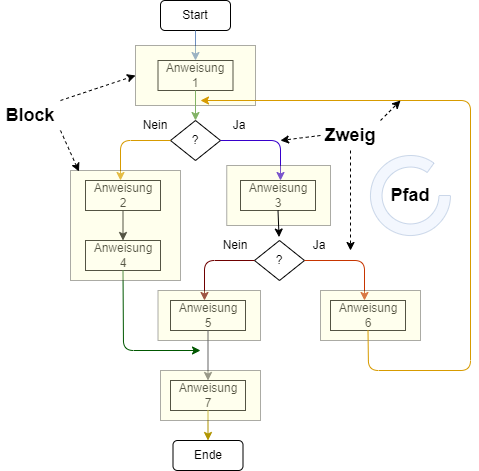

# Whitebox Tests
Whitebox Analyse ist ein formelles Analyseverfahren, bei dem der Entwickler den Code vorliegen hat. Über die speziellen Funktionen des Programms in Form einer Spezifikation muss er nicht informiert sein.

## von Anweisungen, Blöcken, Zweigen und Pfaden
Ein Programm wird dabei betrachtet als eine Reihe von Anweisungen. Diese Anweisungen bilden Blöcke, die durch Kontrollflusselemente wie Bedingungen und Schleifen aufgeteilt wird in verschiedene Zweige und Pfade.



Ziel des Whiteboxtests ist es dabei eine Überdeckung (Code Coverage) von 1 zu erreichen. Damit ist das Programm (die Methode) correct. Der tester muss also kein Wissen haben fun der konkreten Funktion einer Methode (deren Spezifikation).

## Anweisungs- oder Blocküberdeckung

Bei der Anweisungs- oder Blocküberdeckung versucht man alle Anweisungen bzw. Blöcke eines Programms zu erreichen. Gelingt dieses, so ist die Coverage $C_{0} = 1$ bzw. $C_{Block} = 1$

$C_{0} = \frac{Anzahl der ausgeführten Anweisungen}{Anzahl der Anweisungen}$

$C_{Block} = \frac{Anzahl der ausgeführten Blöcke}{Anzahl der Blöcke}$

### Beispiel
Folgender Code soll mit Hilfe einer Blocküberdeckung getestet werden.

```java
public static int calc(int a,int b) {
    int a,y,z;
    if (a < b) {
        x=b; // Block 1
        z=1;
    }
    else {
        x=a; // Block 2
        z=0;
    }
    if ((a+b)<10) {
        y=x+b/z; // Block 3
    }
    else {
        y=x+a; // Block 4
        if ((a+b) == 7) {
            y++ // Block 5
        }
    }
    return x+y+z; // Block 6
}
```

Mit Hilfe eines Testprogramms versucht man nun alle 6 Blöcke zu erreichen.

```java
public static int calc(int a,int b) {
    int a,y,z;
    if (a < b) {
        x=b; // Block 1
        z=1;
        System.out.println("B1");
    }
    else {
        x=a; // Block 2
        z=0;
        System.out.println("B2");
    }
    if ((a+b)<10) {
        y=x+b/z; // Block 3
        System.out.println("B3");
    }
    else {
        y=x+a; // Block 4
        System.out.println("B4");
        if ((a+b) == 7) {
            y++ // Block 5
            System.out.println("B5");
        }
    }
    System.out.println("B6");
    return x+y+z; // Block 6
}
```

|Testwerte|erreichte Blöcke soll| erreichte Blöcke ist|soll-ist Vergleich|
|--|--|--|--|
|a=2; b=5|1,3,6| B1; B3; B6 | ok|
|a=11; b=4|2,4,6| B2; B4; B6 | ok|
|?|5| nicht erreichbar | Fehler|

Damit beträgt die Blocküberdeckung $C_{Block} = 0,83$

$C_{Block} = \frac{5}{6}$

Der Tester hat also formell nachgewiesen, dass keine Blocküberdeckung von 1 erreicht werden kann, d.h. dass der Code fehlerhaft ist.

## Zweigüberdeckung


$C_{Zweig} = \frac{Anzahl der ausgeführten Zweige}{Anzahl der Zeige}$
