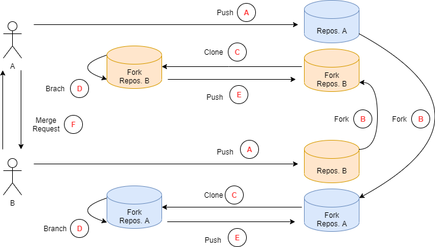

# Übungsaufgabe zum Arbeiten mit git

## Gehen Sie wie folgt vor
Arbeiten Sie im weiteren in Partnerarbeit!

**A)** 
- Erzeugen Sie auf gitlab ein leeres Repository
- Übertragen Sie das evPlan Repository in dieses leere Repository mittels *push*.

**B)** 
- Suchen Sie auf gitlab das Repositories ihres Partners und erstellen Sie von diesem Repository einen *fork*.

**C)** 
- Übertragen Sie das geforkte Repository mittels *clone* auf ihren Rechner.

**D)** 
- Erzeugen Sie einen Branch mit dem Namen "dev".
- Korrigieren Sie in diesem Branch einen während des Testens gefunden Fehler.

**E)** 
- Aktualisieren Sie das geforkte Repository, indem Sie den Branch mittel *push* senden.

**F)** 
- Benachrichtigen Sie ihren Partner über einen Merge Request, dass Sie einen Fehler behoben haben.
- Der Partner schaut sich den Merge Request an und übernimmt ihn in sein Repository.

